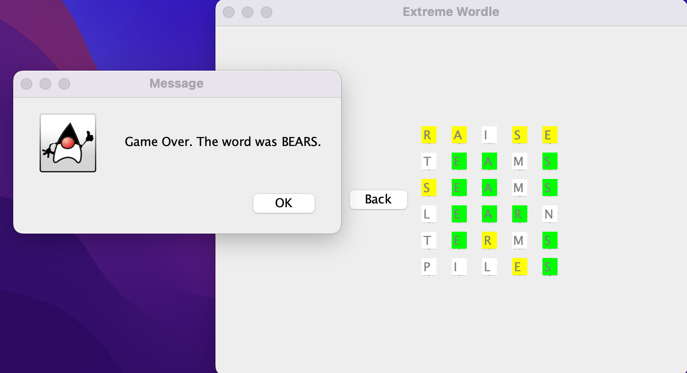

# ExtremeWordle Background
This is a [Wordle](https://www.nytimes.com/games/wordle/index.html) variant that has various difficulty levels and was built 
using Java 18.0.1 for the back-end and Java Swing for the front-end. Information regarding Wordle can be found [here](https://en.wikipedia.org/wiki/Wordle).

The wordle answer chosen by the program (which the user will then try to guess) is a random five letter word which is selected 
from a list of English words sorted by the number of times they occur in a large English corpus. This list was created by Peter 
Norvig (who served as the director of research at Google) who wrote an [article](http://norvig.com/mayzner.html) about the 
research. Norvig's list, which was imported as this [.txt file](https://norvig.com/google-books-common-words.txt), is based on 
the Google books Ngrams data set, which compiles word counts from all books scanned by Google. Each of the 5 difficulty levels 
chooses from a subset of the 5-letter words from Norvig's list. The subsets associated with each of the modes are described below:

Easy Mode: First 10% of the words in the list (the most common words in the list because the list is sorted by word commonness in descending order)  
Medium Mode: Next 10% of words  
Hard Mode: Next 20% of words  
Very Hard Mode: Next 30% of words  
Extreme Mode: Last 30% of words (the least common words in the list)

Each time the user selects a new difficulty, a new word will be selected by the program which will correspond to the selected difficulty. Each selected word, as well as each guess entered by the user, will be validated against an [English word list repository](https://github.com/lorenbrichter/Words/blob/master/Words/en.txt).

# Application Setup
1. Ensure [Java 18.0.1](https://www.oracle.com/java/technologies/javase/jdk18-archive-downloads.html) or a compatible version is installed.
2. Download and unzip the package "ExtremeWordle".
3. In the file "WordleGUI.java", run the main method in an IDE of choice (Visual Studio Code is preferred).
4. Close the pop-up java GUI window before re-running the application.

# Application Walkthrough
On application startup, the user is presented with a welcome screen which contains the difficulty options the user can choose from.

When the user selects one of the difficulty options, the following screen will appear. At any point, the user can select the "Back" button to return to the difficulty selection screen. Selecting a new difficulty (or the same difficulty) will reset the game and the wordle answer.

Users can enter their guesses on this screen, where each text box will accept one letter in each 5-letter word. When the user wants to enter a word, the user should press enter. If the word is not 5 letters, has already been guessed, or is not a valid English word, the following pop-up will appear to let the user know that the word is invalid.

If the guess is accepted and the guess is not the same as the Wordle answer, the text fields, which each correspond to one letter in the guess, will be highlighted with colors according to the following template: 

White: The letter is not contained in the Wordle answer. 
Yellow: The letter is found in the Wordle answer but is not in the correct position. 
Green: The letter is found in the Wordle answer and is in the correct position.

The following is an image of a user playing on medium mode where the Wordle answer is "DRAFT". As the image shows, the colors in the guesses follow the logic in the template above.

If the guess is accepted and it is the same as the Wordle answer, then a pop-up saying "You Win" will appear. This is illustrated in the image below which uses the same example where the answer is "DRAFT".

However, if the user guesses six 5-letter words without guessing the Wordle answer, the user loses the game and the following pop-up box appears which contains the Wordle answer.

The extreme mode is the hardest difficulty, and chooses the Wordle answer from some of the rarest words in the English dictionary. The following image shows the Wordle answer from a game in the extreme mode. The word is "ENROL", which is a less common variant of enroll. As this shows, the words chosen for the harder difficulties can be very difficult to guess.

